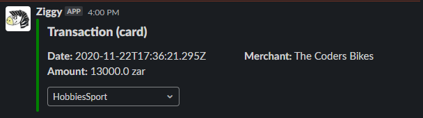
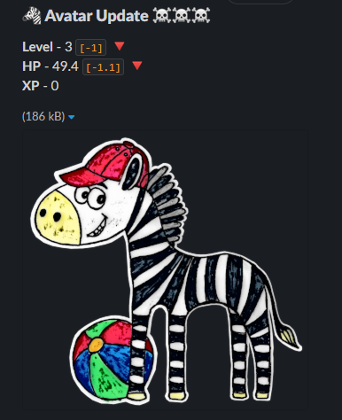
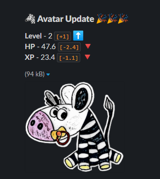

# Overview
Thanks to an **Offerzen** hackathon, we designed a game using the **Investec Programmable Banking API**, the Google Cloud Platform for processing and Slack to facilitate communications.

# The rationale
Many people struggle to build good financial habits thanks to the ease of shopping online and the instant gratification they receive, which is more alluring than watching a savings account grow a few cents at time. We want to help users build better financial awareness, one habit at a time, using gamification to incentivise good habits. Our solution gives users a fun and practical way of developing better spending habits, through individualised objectives and instant progress feedback.

# Demo video
*post video link here*

# Design Diagram

# Gameplay

## Goals
1. Define a goal by stating a *volume* or *value target* for a certain period.
2. You can link the goal to a specific Merchant, or do a manual categorisation of the transaction.

*Transaction notification with manual categorisation option*

## Levels
We created an avatar with 5 levels, which represents the game level in a visual way.

Level **up** or **down** based on remaining on you goal's target.

*Notification received when leveling down to Level 3.*

*Notification received when leveling up to Level 2.*
