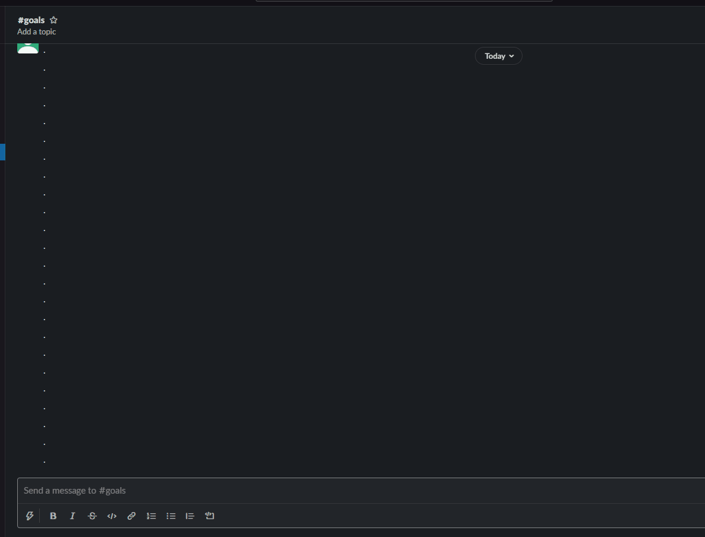
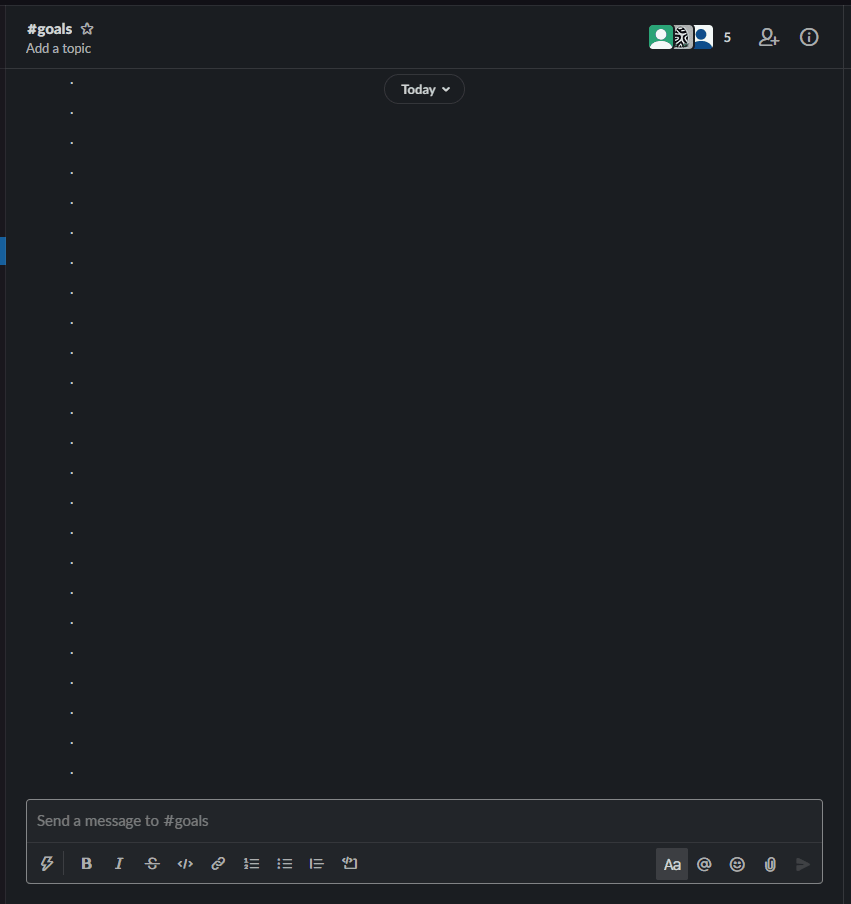

# Index
1. [Overview](#overview)
    1. [How will this project benefit you?]()
    2. [Built with]()
2. [Gameplay](#gameplay)
    1. [Game rules:video_game:](#gameplay)
        1. [Health points](#health-points)
        2. [Experience points](#experience-points)
        3. [Levels](#levels)
    2. [Gameplay components]()
        1. [Goals](#goals)
        2. [Transactions](#transactions)
        3. [Notifications (Slack)](#notifications-(slack))
3. [Project Design](#project-design)
4. [Setup](#setup)

# Overview
Many people struggle to build good financial habits thanks to the ease of shopping online and the instant gratification they receive, which is more alluring than watching a savings account grow a few cents at time. This project aims to help users build better financial awareness, one habit at a time, using gamification to incentivise good habits. The project gives users a fun and practical way of developing better spending habits, through individualised objectives and instant progress feedback.

### How will this project benefit you?
The goal of this project is to help players build better financial habits using gamification as an incentive to set good habits and stick to those set habits. By making progress on a goal, a player can see their avatar grow and gain experience, much like they are. Additionally, this project can be used by parents to set financial goals for their kids to teach them good financial habits from a young age.

Watch a demo of the project [here](https://youtu.be/075jidzoJQs).

### Built with
The project was built using: 
* [Investec Programmable Banking Card](https://developer.investec.com/programmable-banking/#programmable-banking)
* Google Cloud Platform
* Custom Slackbot
* Python3

Planned expansion includes:
* Using the [Investec OpenAPI](https://developer.investec.com/programmable-banking/#open-api) to process transactions like inter-account transfers daily. 

# Gameplay
## Game rules:video_game:
### Health points
Health points (HP) represents the health of a player. A player can have a maximum of 50 HP. 

#### Gaining/Losing HP
A player will gain HP daily.
If a player levels up, the HP will be reset to the maxiumum of 50.

A player will lose HP:
* If the end date is reached for a spendings goal and the payer has gone over the goal limits,
* If the end date is reached for a savings goal and the player has not reached the target,
* When a transaction is made and the transaction is matched to an active goal.

### Experience points
Experience points (XP) tracks a player's progress. Players gain eperience points primarily by setting and completing goals. 

A player can gain a level by gaining a certain amount of experience points. Once a player gains a level, the XP is reset to 0, however, any extra XP is carried over.

#### Gaining/Losing XP
A player will gain XP:
* If a transaction is made, matched to a spendings goal and the goal limits has not been reached,
* If a new goal is made,
* If a goal is completed and the player has managed to stay within limits (spending) or reached target (savings)

A player will lose XP:
* If the end date of a spendings goal has been reached and the player has gone over the goal limits,
* If the end date of a savings goal has been reached and the player has not reached target,
* If a transaction is made, matched to a spendings goal and the goal limits has been reached,

### Levels
The game consists of 5 levels. A player will level up by reaching a certain amount of XP points. A player will lose a level when their HP runs out.

## Gameplay components
### Goals
Goals are needed to gain experience points. Without goals, a player cannot attempt to create good habits. Goals can be created using the Ziggy Slackbot.

*Creating a new goal*

### Transactions
Transactions are how a player progresses through the game. Each time a player makes a transaction, tehy will receive a slack notification with the details of the transaction. The player can change the budget category of the transaction in the Slackbot.

*Transaction notification with categorisation*

### Notifications (Slack)
The interface for the game is a custom Slackbot called Ziggy. Using the Slackbot, players will receive near instantaneous notifications of the progress their avatar makes. These notifications include avatar updates and new transaction notifications.

*Different notifications a player receives*

# Project Design
The project is design to be cloud native on Google Cloud Platform. The project makes use of:
* Cloud Functions and Cloud Run to do most of the processing, 
* Firestore for data storage, 
* Pub/Sub for event triggers and communication, and 
* Cloud Scheduler to schedule daily tasks.

The diagram below shows a simplified overview of the system design and implementation.

**The system flow is as follows:**

The user can create goals using the Slackbot. The goal is added to the goals collection in the firestore database. The goal create function triggers the game_engine_process_new_goal cloud function that increases the avatar xp. The update to the avatar document posts a message to the avatar change Pub/Sub which sends a notification to the user using the Slackbot.

The user can update or delete goals as well, usingthe Slackbot. The update or delete goals actions do not trigger any changes to the avatar. The goal document inthe goals collection in Firestore is updated as required.

When the user uses their Investec Programmable Card, the transaction is captured and stored in the transactions collection in Firestore. The `create` event triggers the transaction_categorise cloud function that attempts to categorise the transaction based on the merchant. A notification is created to send to the user using the Slackbot. The user has the option of setting or updating the transaction category. 

The setting or updating of the transaction category triggers an update event. The firestore update event triggers the game_engine_process_transaction cloud function. This function processes the transaction against goals and update the avatar as needed (xp, hp, and level). Once the avatar has been updated, a notification is sent to the user using the Slackbot.

A daily process is also triggered using Cloud Scheduler and a Pub/Sub. This triggers a few daily tasks such as increasing the avatar health, activating and deactviating goals, and processing completed goals.

# Setup

1. Create Google Cloud Project.
2. Create a Firestore database [(Instructions)](firestore/README.md).
3. Create Storage bucket and upload avatar images [(Instructions)](images/avatar/README.md).
4. Create Pub/Sub topics [(TODO: Instructions)](pub-sub/README.md).
5. Create Slack App Cloud Run [(TODO: Instructions)](cloud-run/README.md).
6. Create Cloud Functions
    - Transaction Add function [(Instructions)](cloud-functions/transaction_add/README.md).
    - Game Engine - Process transaction function [(Instructions)](cloud-functions/game_engine_process_transaction/README.md).
    - Game Engine - Process new goal function [(Instructions)](cloud-functions/game_engine_process_new_goal/README.md).
    - Game Engine - Daily update function [(Instructions)](cloud-functions/game_engine_daily/README.md).
    - Transaction Categorise function [(Instructions)](cloud-functions/transaction_categorise/README.md).
7. Create API Gateway. [(Instructions)](api-gateway/README.md).
8. Upload code to Investec programmable card. [(Instructions)](card/README.md).