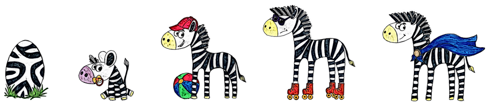

# Index
1. [Overview](#overview)
2. [The Rationale](#the-rationale)
3. [Demo Video](#demo-video)
4. [Gameplay](#gameplay)
5. [Project Design](#project-design)
6. [Setup](#setup)

# Overview
Many people struggle to build good financial habits thanks to the ease of shopping online and the instant gratification they receive, which is more alluring than watching a savings account grow a few cents at time. We want to help users build better financial awareness, one habit at a time, using gamification to incentivise good habits. Our solution gives users a fun and practical way of developing better spending habits, through individualised objectives and instant progress feedback.

## How will this project benefit you?
The goal of this project is to help players build better financial habits using gamification as an incentive to set good habits and stick to those set habits. By making progress on a goal, a player can see their avatar grow and gain experience, much like they are. Additionally, this project can be used by parent to set financial goals for their kids to teach them good financial habits from a young age.

Watch a demo of the project [here](https://youtu.be/075jidzoJQs).

## Investec Programmable Banking components used
* The project makes use of the Investec Programmable Banking Card. 
* Planned expansion includes using the Investec OpenAPI to process transactions like inter-account transfers daily. 

# Gameplay

## Goals
1. Define a goal by stating a *volume* or *value target* for a certain period.
2. You can link the goal to a specific Merchant, or do a manual categorisation of the transaction.

*Transaction notification with manual categorisation option*

## Levels
We created an avatar with 5 levels, which represents the game level in a visual way.

Level **up** or **down** based on remaining on you goal's target.

*Notification received when leveling down to Level 3.*

*Notification received when leveling up to Level 2.*

## Game rules :video_game:

### Health points
Health points (HP) represents the health of a player. A player can have a maximum of 50 HP. T

#### Gaining/Losing HP
A player will gain HP daily.
If a player levels up, the HP will be reset to the maxiumum of 50.

A player will lose HP:
* If the end date is reached for a spendings goal and the payer has gone over the goal limits,
* If the end date is reached for a savings goal and the player has not reached the target,
* When a transaction is made and the transaction is matched to an active goal.

### Experience points
Experience points (XP) tracks a player's progress. Players gain eperience points primarily by setting and completing goals. 

A player can gain a level by gaining a certain amount of experience points. Once a player gains a level, the XP is reset to 0, however, any extra XP is carried over.

#### Gaining/Losing XP
A player will gain XP:
* If a transaction is made, matched to a spendings goal and the goal limits has not been reached,
* If a new goal is made,
* If a goal is completed and the player has managed to stay within limits (spending) or reached target (savings)
* 

A player will lose XP:
* If the end date of a spendings goal has been reached and the player has gone over the goal limits,
* If the end date of a savings goal has been reached and the player has not reached target,
* If a transaction is made, matched to a spendings goal and the goal limits has been reached,

### Levels
The game consists of 5 levels. A player will level up by reaching a certain amount of XP points.

# Project Design
The project is design to be cloud native on Google Cloud Platform. The project makes use of:
* Cloud Functions and Cloud Run to do most of the processing, 
* Firestore for data storage, 
* Pub/Sub for event triggers and communication, and 
* Cloud Scheduler to schedule daily tasks.

The diagram below shows a simplified overview of the system design and implementation.

# Setup

1. Create Google Cloud Project.
2. Create a Firestore database [(Instructions)](firestore/README.md).
3. Create Storage bucket and upload avatar images [(Instructions)](images/avatar/README.md).
4. Create Pub/Sub topics [(TODO: Instructions)](pub-sub/README.md).
5. Create Slack App Cloud Run [(TODO: Instructions)](cloud-run/README.md).
6. Create Cloud Functions
    - Transaction Add function [(Instructions)](cloud-functions/transaction_add/README.md).
    - Game Engine - Process transaction function [(Instructions)](cloud-functions/game_engine_process_transaction/README.md).
    - Game Engine - Process new goal function [(Instructions)](cloud-functions/game_engine_process_new_goal/README.md).
    - Game Engine - Daily update function [(Instructions)](cloud-functions/game_engine_daily/README.md).
    - Transaction Categorise function [(Instructions)](cloud-functions/transaction_categorise/README.md).
7. Create API Gateway. [(Instructions)](api-gateway/README.md).
8. Upload code to Investec programmable card. [(Instructions)](card/README.md).